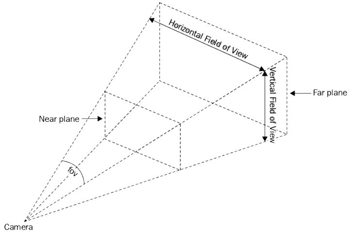

## Three.js

### scene

```javascript
var scene = new THREE.Scene();
var camera = new THREE.PerspectiveCamera( 75, window.innerWidth / window.innerHeight, 0.1, 1000 );
var renderer = new THREE.WebGLRenderer();
renderer.setSize( window.innerWidth, window.innerHeight );
document.body.appendChild( renderer.domElement );
```

### renderer

#### WebGLRenderer


### Camera

#### PerspectiveCam

> PerspectiveCamera(fov: Number, aspect: Number, near: Number, far: Number)
> fov-摄像机视椎体垂直视野角度
> aspect-摄像机视椎体长宽比
> near-摄像机水椎体近端面
> far-摄像机视椎体远端面



position, up, lookat

相机默认有正z轴，看向-z轴，就像我们从屏幕外看向屏幕内。

> camera.postion：相机所在的位置，默认为（0，0，0）
> camera.up：坐标轴向上方向，默认（0，1，0）。要设置在camera.lookAt前才有效
> camera.lookAt：相机焦点方向，默认为Z轴负半轴方向


### loader

#### TextureLoader

内部使用 ImageLoader 来加载文件。

```javascript
var texture = new THREE.TextureLoader().load('./img/zhengfeng.jpg');
var material = new THREE.MeshBasicMaterial({
    map: texture,
});


 var loader = new THREE.TextureLoader();
var geometry2 = new THREE.BoxGeometry(300, 200, 200);
var materialArray = [
    new THREE.MeshBasicMaterial({
        map: loader.load('./img/3.webp'), 
    }),
    new THREE.MeshBasicMaterial({
        map: loader.load('./img/4.webp'), 
    }),
    new THREE.MeshBasicMaterial({
        map: loader.load('./img/5.webp'), 
    }),
    new THREE.MeshBasicMaterial({
        map: loader.load('./img/6.webp'), 
    }),
    new THREE.MeshBasicMaterial({
        map: loader.load('./img/7.webp'), 
    }),
    new THREE.MeshBasicMaterial({
        map: loader.load('./img/8.webp'), 
    }),
]
var cube = new THREE.Mesh(geometry2, materialArray);
scene.add(cube);

```

#### cubeTextureLoader

> CubeTextureLoader is for CubeMap which is used for SkyBox or EnvMap, is not really for adding textures on a 'cube' mesh.
