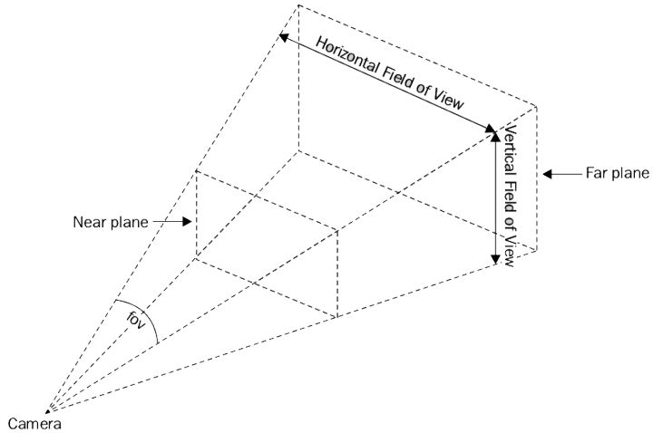

## Three.js

### scene

```javascript
var scene = new THREE.Scene();
var camera = new THREE.PerspectiveCamera( 75, window.innerWidth / window.innerHeight, 0.1, 1000 );
var renderer = new THREE.WebGLRenderer();
renderer.setSize( window.innerWidth, window.innerHeight );
document.body.appendChild( renderer.domElement );
```

### renderer

#### WebGLRenderer


### Camera

#### PerspectiveCam

> PerspectiveCamera(fov: Number, aspect: Number, near: Number, far: Number)
> fov-摄像机视椎体垂直视野角度
> aspect-摄像机视椎体长宽比
> near-摄像机水椎体近端面
> far-摄像机视椎体远端面


